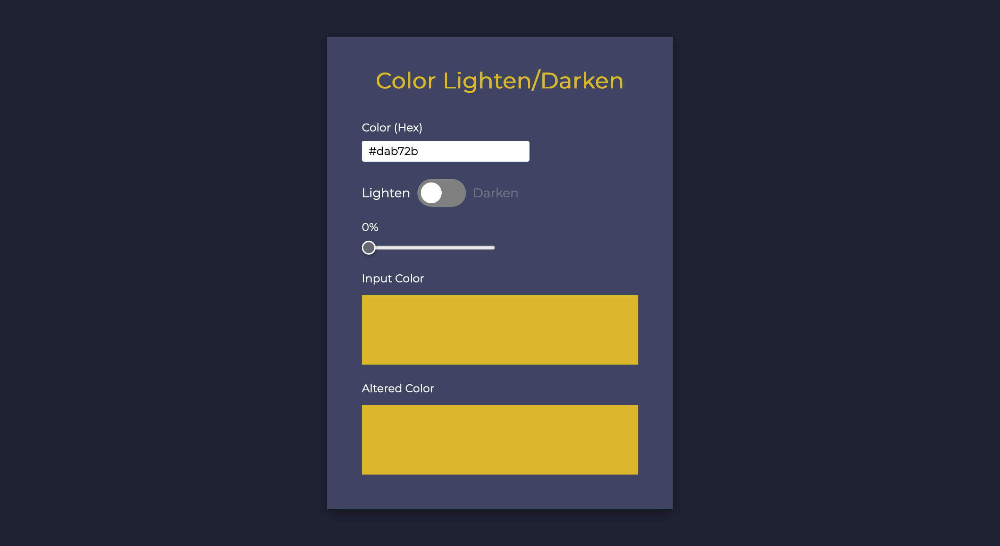

# Color Lighten/Darken Tool

This is a project of the [Scrimba](https://scrimba.com) Frontend Career Path.

## About The Project

The project aims to lighten or darken a color based on the user's selection. The Hex code is converted into the RGB system in order to alter the color.

Live site: https://color-lighten-darken-by-alphfonti.netlify.app

## Acknowledgments

- [James Q Quick](https://www.youtube.com/c/jamesqquick)
